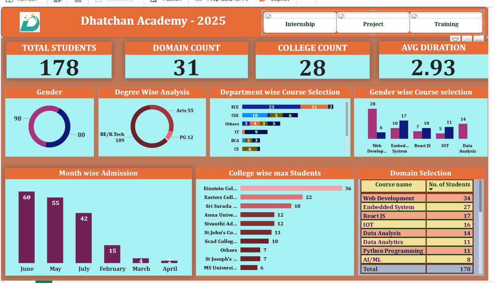

# Student Analytics Dashboard (Dhatchan Academy)

## 📊 Project Overview
This project presents a Power BI dashboard analyzing student data from Dhatchan Academy. It provides insights into student enrollment, course preferences, and academic trends to support data-driven decision-making.

## 🔧 Tools Used
- Power BI  
- Excel  

## 📈 Key Insights
- Total Students: 178 across 28 colleges and 31 domains  
- Gender distribution analysis showing student participation trends  
- Degree-wise analysis (BE/B.Tech, Arts, PG)  
- Identified top domains like Web Development, Embedded Systems, and Data Analysis  
- Department-wise course selection (ECE, CSE, IT, etc.)  
- Month-wise admission trends to track enrollment patterns  
- College-wise student distribution highlighting top contributing institutions  

## 📂 Files Included
- Power BI Dashboard (Dhatchan Academy Report.pbix)  
- Dataset (Dhatchan Academy.xlsx)  
- Dashboard Screenshot (dashboard.png)  

## 📷 Dashboard Preview

